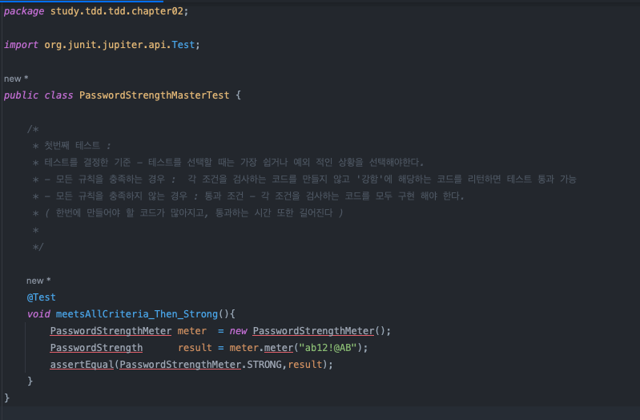
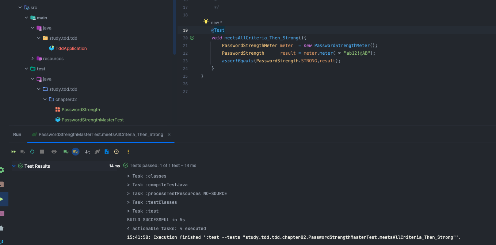
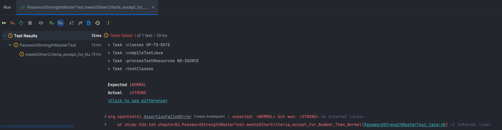
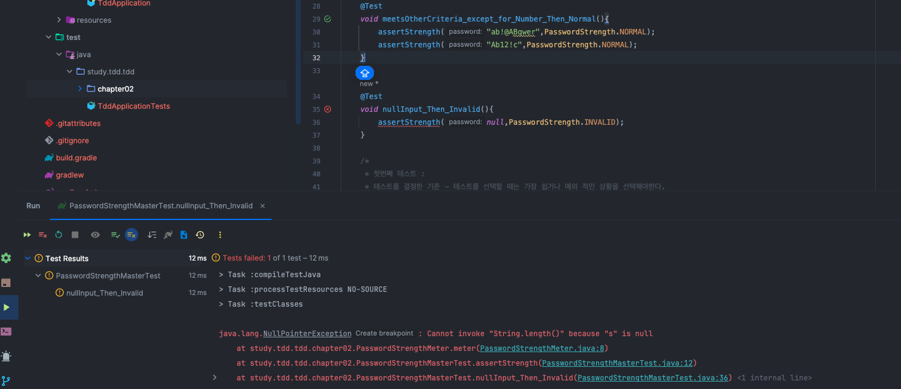
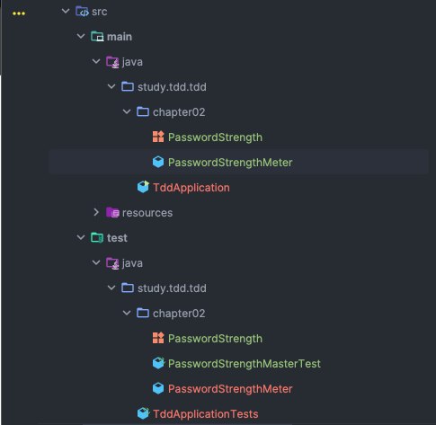

# TDD 
> 테스트 주도 개발 시작하기 
> 최범균 저 
>
> 실습 환경 : SpringBoot 3.2.11 version 


# Chapter 02 
- TDD 시작 

## TDD 란?
> 테스트 주도 개발이라는 뜻을 가짐 
> 테스트를 하고 그 이후 코드를 구현하는 것을 말한다.
> ( 테스트를 먼저 한다 => 기능이 올바르게 동작하는지 검증하는 코드를 작성한다. )
>
> TDD 는 테스트를 먼저 작성하고 실패하면
> 테스트를 통과 시킬 만큼 코드를 추가하는 과정을 반복하며
> 점진적으로 기능을 완성해 나간다. 

* 팁
- src/test/java 소스 폴더는 배포 대상이 아니므로 
- src/test/java 폴더에 코드를 만들면 완성되지 않는 코드가 배포되는 것을 
- 방지할 수 있다.


## TDD 예 : 암호검사기 
> 암호검사기 : 문자열을 검사해서 규칙을 준수하는지에 따라 
> '약함', '보통', '강함' 으로 구분하는 기능을 만들어 보자.
> **조건**
> 1. 길이가 8자리 이상
> 2. 0 부터 9 사이의 숫자를 포함 
> 3. 대문자 포함 
>
> **결과**
> 1. 세 규칙을 모두 충족하면 암호는 강함
> 2. 두 규칙을 충족하면 보통
> 3. 1개 이하의 규칙을 충족하면 약함 
>

### 1. 테스트를 진행할 클래스를 먼저 작성
- 테스트를 진행할 클래스를 먼저 작성 
```java
package study.tdd.tdd.chapter02;

import org.junit.jupiter.api.Test;

public class PasswordStrengthMasterTest {

    @Test
    void name(){
        
    }
}
```


### 2. 가장 쉽고 예외적인 상황을 테스트 코드로 작성한다. 첫번째 테스트 조건 : 모든 테스트 조건을  충족하는 경우
     * 첫번째 테스트 :
     * 테스트를 결정한 기준 - 테스트를 선택할 때는 가장 쉽거나 
                         예외 적인 상황을 선택해야한다.
     
     * - 모든 규칙을 충족하는 경우 :  각 조건을 검사하는 코드를 만들지 않고 
                                '강함'에 해당하는 코드를 리턴하면 
                                테스트 통과 가능
     
     * - 모든 규칙을 충족하지 않는 경우 : 통과 조건 - 각 조건을 검사하는 코드를 
                                  모두 구현 해야 한다.
                                  ( 한번에 만들어야 할 코드가 많아지고, 
                                  통과하는 시간 또한 길어진다 )

1. 테스트에 맞는 이름으로 method 생성 및 구현 
```java
    @Test
    void meetsAllCriteria_Then_Strong(){
        PasswordStrengthMeter meter  = new PasswordStrengthMeter();
        PasswordStrength      result = meter.meter("ab12!@AB");
        assertEqual(PasswordStrengthMeter.STRONG,result);
    }
```



2. 메소드에 필요한 값들을 생성 ( PasswordStrengthMeter 이나 PasswordStrength 클래스 )

- PasswordStrengthMeter
  ```java
  package study.tdd.tdd.chapter02;

    public class PasswordStrengthMeter {

        public  PasswordStrength meter(String s){
            return PasswordStrength.STRONG;
        }
    }
  ```

- PasswordStrength
  ```java
    package study.tdd.tdd.chapter02;

    // ** TDD 는 통과시킬 만큼의 코드를 작성한다.
    public enum PasswordStrength {
        STRONG
    }
  ```  



- 모든 규칙을 충족하는 예를 하나 더하면 
  ```java
  package study.tdd.tdd.chapter02;

    import org.junit.jupiter.api.Assertions;
    import org.junit.jupiter.api.Test;

    import static org.junit.jupiter.api.Assertions.assertEquals;

    public class PasswordStrengthMasterTest {

        /*
        * 첫번째 테스트 :
        * 테스트를 결정한 기준 - 테스트를 선택할 때는 가장 쉽거나 예외 적인 상황을 선택해야한다.
        * - 모든 규칙을 충족하는 경우 :  각 조건을 검사하는 코드를 만들지 않고 '강함'에 해당하는 코드를 리턴하면 테스트 통과 가능
        * - 모든 규칙을 충족하지 않는 경우 : 통과 조건 - 각 조건을 검사하는 코드를 모두 구현 해야 한다.
        * ( 한번에 만들어야 할 코드가 많아지고, 통과하는 시간 또한 길어진다 )
        *
        */

        @Test
        void meetsAllCriteria_Then_Strong(){
            PasswordStrengthMeter meter  = new PasswordStrengthMeter();
            PasswordStrength      result = meter.meter("ab12!@AB");
            assertEquals(PasswordStrength.STRONG,result);
            PasswordStrength      result2 = meter.meter("abc1!Add");
            assertEquals(PasswordStrength.STRONG,result2);
        }
    }
    ```


  
### 2. 테스트 : 길이만 8 글자 미만이고 나머지 조건을 충족하는 경우
- 조건 하나만 충족하지 못함으로 보통이여야 한다.
- PasswordStrengthMasterTest
  ```java
    @Test
    void meetsOtherCriteria_except_for_Length_Then_Normal(){
        PasswordStrengthMeter meter  = new PasswordStrengthMeter();
        PasswordStrength      result = meter.meter("ab12!@A");
        assertEquals(PasswordStrength.NORMAL, result);
    }
  ```  

- PasswordStrengthMeter
  ```java
    package study.tdd.tdd.chapter02;

    public class PasswordStrengthMeter {

        public  PasswordStrength meter(String s){
    //        return PasswordStrength.STRONG; // 첫번째 테스트만 통과
            return PasswordStrength.NORMAL;   // 두번째 테스트만 통과
        }
    }
  ```

- PasswordStrength
  ```java
    package study.tdd.tdd.chapter02;

    // ** TDD 는 통과시킬 만큼의 코드를 작성한다.
    public enum PasswordStrength {
        STRONG,
        NORMAL
    }
  ```  

- 이 경우 첫번째 테스트만 충족하기 때문에 
- 두개의 테스트를 모두 통과 시키기 위해서 코드를 수정

- PasswordStrengthMeter
  ```java
    package study.tdd.tdd.chapter02;

    public class PasswordStrengthMeter {

        public  PasswordStrength meter(String s){

            if(s.length() < 8){
                return PasswordStrength.NORMAL;   // 두번째 테스트만 통과
            }
            return PasswordStrength.STRONG; // 첫번째 테스트만 통과
        }
    }

  ```
### 3. 세번째 테스트 : 숫자를 포함하지 않고 나머지 조건 충족하는 경우 
- 역시 하나만 만족하지 못함으로 결과로 NORMAL 을 반환해야한다.
```java
    @Test
    void meetsOtherCriteria_except_for_Number_Then_Normal(){
        PasswordStrengthMeter meter  = new PasswordStrengthMeter();
        PasswordStrength      result = meter.meter("ab!@ABqwer");
        assertEquals(PasswordStrength.NORMAL, result);
    }
```

- 암호가 숫자를 포함했는지 판단하여 포함되지 않을 경우 NORMAL 을 RETURN 하는 로직으로 변경 
  
- PasswordStrengthMeter
  ```java
        public  PasswordStrength meter(String s){

        // ** 문자열의 길이가 8 보다 큰지
        if(s.length() < 8){
            return PasswordStrength.NORMAL;   // 두번째 테스트만 통과
        }

        // ** 문자열에 숫자가 포함되어 있는지
        boolean isContainNum = false;
        for( char ch : s.toCharArray() ) {
            if(ch >= '0' && ch <= '9'){
                isContainNum = true;
                break;
            }
        }

        if(!isContainNum) return PasswordStrength.NORMAL; // 첫번째 테스트만 통과
        return PasswordStrength.STRONG;
    }
  ```
- Refactoring 진행
    ```java
    package study.tdd.tdd.chapter02;

    public class PasswordStrengthMeter {

        public  PasswordStrength meter(String s){

            // ** 문자열의 길이가 8 보다 큰지
            if(s.length() < 8){
                return PasswordStrength.NORMAL;   // 두번째 테스트만 통과
            }

            // ** 문자열에 숫자가 포함되어 있는지
            if(!isMeetsContainingNumberCriteria(s)) return PasswordStrength.NORMAL; // 첫번째 테스트만 통과
            return PasswordStrength.STRONG;
        }

        private boolean isMeetsContainingNumberCriteria(String s){
            for( char ch : s.toCharArray() ) {
                if(ch >= '0' && ch <= '9'){
                    return true;
                }
            }
            return false;
        }
    }
    ```

### 테스트 코드 리팩토링 
```java
package study.tdd.tdd.chapter02;

import org.junit.jupiter.api.Test;

import static org.junit.jupiter.api.Assertions.assertEquals;

public class PasswordStrengthMasterTest {

    private PasswordStrengthMeter meter = new PasswordStrengthMeter();

    private void assertStrength(String password, PasswordStrength expStr){
        PasswordStrength result = meter.meter(password);
        assertEquals(result,expStr);
    }

    @Test
    void meetsAllCriteria_Then_Strong(){
        assertStrength("ab12!@AB",PasswordStrength.STRONG);
        assertStrength("abc1!Add",PasswordStrength.STRONG);
    }

    @Test
    void meetsOtherCriteria_except_for_Length_Then_Normal(){
        assertStrength("ab12!@A",PasswordStrength.NORMAL);
        assertStrength("Ab12!c",PasswordStrength.NORMAL);
    }

    @Test
    void meetsOtherCriteria_except_for_Number_Then_Normal(){
        assertStrength("ab!@ABqwer",PasswordStrength.NORMAL);
        assertStrength("Ab12!c",PasswordStrength.NORMAL);
    }


    /*
     * 첫번째 테스트 :
     * 테스트를 결정한 기준 - 테스트를 선택할 때는 가장 쉽거나 예외 적인 상황을 선택해야한다.
     * - 모든 규칙을 충족하는 경우 :  각 조건을 검사하는 코드를 만들지 않고 '강함'에 해당하는 코드를 리턴하면 테스트 통과 가능
     * - 모든 규칙을 충족하지 않는 경우 : 통과 조건 - 각 조건을 검사하는 코드를 모두 구현 해야 한다.
     * ( 한번에 만들어야 할 코드가 많아지고, 통과하는 시간 또한 길어진다 )
     *
     */

//    @Test
//    void meetsAllCriteria_Then_Strong(){
//        PasswordStrengthMeter meter  = new PasswordStrengthMeter();
//        PasswordStrength      result = meter.meter("ab12!@AB");
//        assertEquals(PasswordStrength.STRONG,result);
//        PasswordStrength      result2 = meter.meter("abc1!Add");
//        assertEquals(PasswordStrength.STRONG,result2);
//    }
//
//    @Test
//    void meetsOtherCriteria_except_for_Length_Then_Normal(){
//        PasswordStrengthMeter meter  = new PasswordStrengthMeter();
//        PasswordStrength      result = meter.meter("ab12!@A");
//        assertEquals(PasswordStrength.NORMAL, result);
//        PasswordStrength      result2 = meter.meter("Ab12!c");
//        assertEquals(PasswordStrength.NORMAL, result2);
//    }
//
//    @Test
//    void meetsOtherCriteria_except_for_Number_Then_Normal(){
//        PasswordStrengthMeter meter  = new PasswordStrengthMeter();
//        PasswordStrength      result = meter.meter("ab!@ABqwer");
//        assertEquals(PasswordStrength.NORMAL, result);
//    }
}

```


### 4. 네번째 테스트 : 값이 존재하지 않는 경우 
- 책에선느 PasswordStrength.INVALID 를 반환하는 것을 선택 
- PasswordStrengthMasterTest
  ```java
    @Test
    void nullInput_Then_Invalid(){
        assertStrength(null,PasswordStrength.INVALID);
    }
  ```

- PasswordStrength
  ```java
    package study.tdd.tdd.chapter02;

    // ** TDD 는 통과시킬 만큼의 코드를 작성한다.
    public enum PasswordStrength {
        STRONG,
        INVALID, 
        NORMAL
    }
  ```

  
- NULL POINT EXCEPTION 발생, 주요 method 에 로직 추가 
- 또한 NULL 뿐만 아니라 빈 문자열이 들어갈 수 도 있다. 
- 이것을 감안하여 로직 추가 
  - PasswordStrengthMeter
  ```java
    package study.tdd.tdd.chapter02;

    public class PasswordStrengthMeter {

        public  PasswordStrength meter(String s){

            if(s == null || s.isEmpty() ) return PasswordStrength.INVALID;
            
            // ** 문자열의 길이가 8 보다 큰지
            if(s.length() < 8){
                return PasswordStrength.NORMAL;   // 두번째 테스트만 통과
            }

            // ** 문자열에 숫자가 포함되어 있는지
            if(!isMeetsContainingNumberCriteria(s)) return PasswordStrength.NORMAL; // 첫번째 테스트만 통과
            return PasswordStrength.STRONG;
        }

        private boolean isMeetsContainingNumberCriteria(String s){
            for( char ch : s.toCharArray() ) {
                if(ch >= '0' && ch <= '9'){
                    return true;
                }
            }
            return false;
        }
    }

  ```


### 5. 대문자를 포함하지 않고 나머지 조건 충족하는 경우 
- PasswordStrengthMasterTest
```java
    @Test
    void meetsOtherCriteria_except_for_UpperCase_Then_Normal(){
        assertStrength("ab12!@df",PasswordStrength.NORMAL);
    }
```

- PasswordStrengthMeter
```java
package study.tdd.tdd.chapter02;

public class PasswordStrengthMeter {

    public  PasswordStrength meter(String s){

        if(s == null || s.isEmpty() ) return PasswordStrength.INVALID;

        // ** 문자열의 길이가 8 보다 큰지
        if(s.length() < 8){
            return PasswordStrength.NORMAL;   // 두번째 테스트만 통과
        }

        // ** 문자열에 숫자가 포함되어 있는지
        if(!isMeetsContainingNumberCriteria(s)) return PasswordStrength.NORMAL; // 첫번째 테스트만 통과

        // ** 문자열에 대문자가 포함이 되어 있는지
        if(isMeetsContainingUpperCaseCriteria(s)) return PasswordStrength.NORMAL;

        return PasswordStrength.STRONG;
    }

    private boolean isMeetsContainingNumberCriteria(String s){
        for( char ch : s.toCharArray() ) {
            if(ch >= '0' && ch <= '9'){
                return true;
            }
        }
        return false;
    }

    private boolean isMeetsContainingUpperCaseCriteria(String s){
        for(char ch : s.toCharArray() ){
            if(Character.isUpperCase(ch))
                return true;
        }
        return false;
    }
}

```

### 6. 길이가 8 글자 이상인 조건만 만족하는 경우 
- 암호 강도 약함을 표현해야한다 
- PasswordStrengthMasterTest
```java
    @Test
    void meetsOnlyLengthCriteria_Then_Week(){
        assertStrength("abdefghi",PasswordStrength.WEAK);
    }
```

- PasswordStrength
```java
public enum PasswordStrength {
    STRONG,
    INVALID,
    NORMAL,
    WEAK
}
```

- PasswordStrengthMeter
```java
    public  PasswordStrength meter(String s){

        if(s == null || s.isEmpty() ) return PasswordStrength.INVALID;


        boolean lengthEnough = s.length() >= 8;
        boolean isContainNum = isMeetsContainingNumberCriteria(s);
        boolean isContainUpp = isMeetsContainingUpperCaseCriteria(s);

        if(lengthEnough && !isContainNum && !isContainUpp ) return  PasswordStrength.WEAK;

        if(!lengthEnough) return  PasswordStrength.NORMAL;
        if(!isContainNum) return  PasswordStrength.NORMAL;
        if(!isContainUpp) return  PasswordStrength.NORMAL;

        return PasswordStrength.STRONG;
    }
```

### 7. 숫자 포함 조건만 충족하는 경우 
- PasswordStrengthMasterTest
```java
    @Test
    void meetsOnlyNumCriteria_Then_Week(){
        assertStrength("12345",PasswordStrength.WEAK);
    }
```

- PasswordStrengthMeter
```java
    public  PasswordStrength meter(String s){

        if(s == null || s.isEmpty() ) return PasswordStrength.INVALID;

        boolean lengthEnough = s.length() >= 8;
        boolean isContainNum = isMeetsContainingNumberCriteria(s);
        boolean isContainUpp = isMeetsContainingUpperCaseCriteria(s);

        if(lengthEnough && !isContainNum && !isContainUpp ) return  PasswordStrength.WEAK;
        if(isContainNum && !lengthEnough && !isContainUpp ) return  PasswordStrength.WEAK;

        if(!lengthEnough) return  PasswordStrength.NORMAL;
        if(!isContainNum) return  PasswordStrength.NORMAL;
        if(!isContainUpp) return  PasswordStrength.NORMAL;

        return PasswordStrength.STRONG;
    }
```

### 8. 대문자 포함 조건만 충족하는 경우
- PasswordStrengthMasterTest
```java
    @Test
    void meetsOnlyNumCriteria_Then_Week(){
        assertStrength("12345",PasswordStrength.WEAK);
    }
```

- PasswordStrengthMeter
```java
    public  PasswordStrength meter(String s){

        if(s == null || s.isEmpty() ) return PasswordStrength.INVALID;


        boolean lengthEnough = s.length() >= 8;
        boolean isContainNum = isMeetsContainingNumberCriteria(s);
        boolean isContainUpp = isMeetsContainingUpperCaseCriteria(s);

        if(lengthEnough && !isContainNum && !isContainUpp ) return  PasswordStrength.WEAK;
        if(isContainNum && !lengthEnough && !isContainUpp ) return  PasswordStrength.WEAK;
        if(isContainUpp && !lengthEnough && !isContainNum ) return  PasswordStrength.WEAK;

        if(!lengthEnough) return  PasswordStrength.NORMAL;
        if(!isContainNum) return  PasswordStrength.NORMAL;
        if(!isContainUpp) return  PasswordStrength.NORMAL;

        return PasswordStrength.STRONG;
    }
```

### 코드 리팩토링 
충족 조건 개수를 기준으로 리팩토링을 해보자
```java
package study.tdd.tdd.chapter02;

public class PasswordStrengthMeter {

    public  PasswordStrength meter(String s){

        if(s == null || s.isEmpty() ) return PasswordStrength.INVALID;
        int meetsCounts = 0;


        if(s.length() >= 8) meetsCounts++;
        if(isMeetsContainingNumberCriteria(s))    meetsCounts++;
        if(isMeetsContainingUpperCaseCriteria(s)) meetsCounts++;


        if(meetsCounts == 1) return PasswordStrength.WEAK;
        if(meetsCounts == 2) return PasswordStrength.NORMAL;
        return PasswordStrength.STRONG;
    }

    private boolean isMeetsContainingNumberCriteria(String s){
        for( char ch : s.toCharArray() ) {
            if(ch >= '0' && ch <= '9'){
                return true;
            }
        }
        return false;
    }

    private boolean isMeetsContainingUpperCaseCriteria(String s){
        for(char ch : s.toCharArray() ){
            if(Character.isUpperCase(ch))
                return true;
        }
        return false;
    }
}
```


### 9 아무 조건을 충족하지 않은 경우 
```java
    @Test
    void meetsNoCriteria_Then_Weak(){
        assertStrength("abc",PasswordStrength.WEAK);
    }
```

```java
    public  PasswordStrength meter(String s){

        if(s == null || s.isEmpty() ) return PasswordStrength.INVALID;
        int meetsCounts = 0;


        if(s.length() >= 8) meetsCounts++;
        if(isMeetsContainingNumberCriteria(s))    meetsCounts++;
        if(isMeetsContainingUpperCaseCriteria(s)) meetsCounts++;

        if(meetsCounts <= 1) return PasswordStrength.WEAK;
        if(meetsCounts == 2) return PasswordStrength.NORMAL;
        return PasswordStrength.STRONG;
    }
```


### 코드의 강도를 계산하는 로직을 따로 분리해서 작성해보자
```java
    public  PasswordStrength meter(String s){

        if(s == null || s.isEmpty() ) return PasswordStrength.INVALID;
        int meetsCounts = getMetCriteriaCounts(s);
        if(meetsCounts <= 1) return PasswordStrength.WEAK;
        if(meetsCounts == 2) return PasswordStrength.NORMAL;
        return PasswordStrength.STRONG;
    }

    private int getMetCriteriaCounts(String s){
        int meetsCounts = 0;
        if(s.length() >= 8) meetsCounts++;
        if(isMeetsContainingNumberCriteria(s))    meetsCounts++;
        if(isMeetsContainingUpperCaseCriteria(s)) meetsCounts++;
        return meetsCounts;
    }

```

### 구현한 TEST 로직을 Main 로직으로 옮긴다.



### TDD 를 경험해 보면서 
> 특정 기능에 필요한 조건들을 나열하고,
> 해당 조건들을 만족하는 경우를 
> 구현, 테스트, 필요시 코드 refactoring 을 반복하여 
> 하나의 기능을 완성해 나갔다. 
>
> 테스트 -> 코딩 -> 리펙토링 과정을 반복하였다.

- 여기서는 **레드-그린-리펙터** 라는 말을 사용했다.

### TDD 는 테스트가 개발을 주도한다.
> 기능을 구현하기 위한 조건들을 테스트 하고, 테스트를 통과하기 위해서
> 코드를 작성하고 검증하는 방식을 반복하다 보니 정말 테스트가
> 코드를 작성하는 과정에서 주도적인 역할을 하게 되었다. 
>
> 또 필요한 조건의 테스트 코드를 먼저 작성하고, 해당 테스트 코드를 
> 통과 시키기 위해 메소드를 지속적으로 수정해 나갔다.
>
> 이로 인해 개발하려는 기능이 더욱 완고 해졌다.

### 지속적인 코드 정리 
> 필요시 지속적인 코드 정리를 진행하였다. 
> 해당 기능에 대한 조건들을 만족하기 위한 코드를 
> 추가해 나가다 보면 중복되는 내용들이 보였고, 그로 인해
> 진행이 될 수록 간결한 코드로 개발이 될 수 있었다
>
> 또한 테스트 코드에서의 리팩토링이다 보니
> 코드 수정에 대한 심리적 불안감을 덜어준다.


### 빠른 피드백 
> 아무래도 테스트 코드에서 코드 작성이 진행되다 보니, 
> 피드백이 빠르다는 장점이 있다.
>
> 테스트를 수행하여 수정한 코드의 문제점은 없는지 직관적으로 확인할 수 있었다.


## 개인적인 생각
> 우선 이번 챕터에서 TDD 를 경험하며 들었던 장단점을 얘기해보겠다. 
>
> 장점
> 1. 기능의 어느 조건을 충족시키기 위해 그 조건에 대한 생각만 하여 코드 작성이 쉬웠다. 
> 2. 조건을 만족하면서 진행하기 때문에, 해당 기능을 견고하게 만들 수 있었다.
> 3. 반복되는 내용들을 파악하기 쉽기 때문에 간결하고 유지보수 적으로 충분한 코드를 만들 수 있었다.
> 4. 확실히 작동 여부를 확인하고 진행하기 때문에 동작에 대한 불안감이 없었다. 
>
> 단점
> 1. 시간이 오래걸린다.
> 2. 해당 기능에 대한 완전한 이해와 파악이 필요하다는 것을 느꼈다.