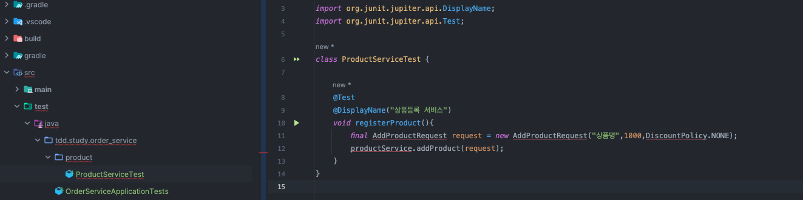
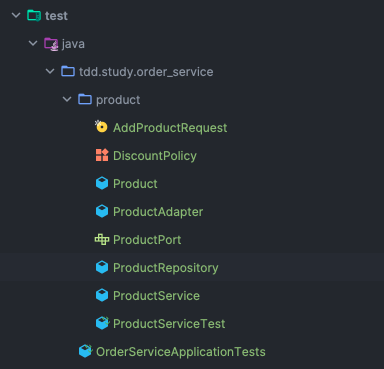

# 1. Project 생성하고, 첫 TEST 작성 
```java
package tdd.study.order_service.product;

import org.junit.jupiter.api.DisplayName;
import org.junit.jupiter.api.Test;

class ProductServiceTest {

    @Test
    @DisplayName("상품등록 서비스")
    void registerProduct(){
        final AddProductRequest request = new AddProductRequest("상품명",1000,DiscountPolicy.NONE);
        productService.addProduct(request);
    }
}
```

> 책에서 배운것 처럼 테스트 부터 먼저 시작하였다. 
> 사용해야할 클래스나 메소드나 객체들을 생성하지 않고 테스트 코드에서 먼저 작성만 한다. 
> 이후 필요한 것들을 직접 생성해 나간다.
>

### 첫번째 테스트 구현 
```java
package tdd.study.order_service.product;

import org.junit.jupiter.api.BeforeEach;
import org.junit.jupiter.api.DisplayName;
import org.junit.jupiter.api.Test;
import org.springframework.util.Assert;

import java.util.HashMap;
import java.util.Map;

class ProductServiceTest {

    private ProductService      productService   ;
    private ProductPort         productPort      ;

    private ProductRepository   productRepository;

    @BeforeEach
    void setUp() {
        productRepository   = new ProductRepository();
        productPort         = new ProductAdapter(productRepository);
        productService      = new ProductService(productPort);
    }

    @Test
    @DisplayName("상품등록 서비스")
    void registerProduct(){
        final String productNm              = "상품명";
        final int price                     = 10_000;
        final DiscountPolicy discountPolicy = DiscountPolicy.NONE;
        final AddProductRequest request     = new AddProductRequest(productNm, price, discountPolicy);
        productService.addProduct(request);
    }

    private record AddProductRequest(String productNm, int price, DiscountPolicy discountPolicy) {
            private AddProductRequest(final String productNm, final int price, final DiscountPolicy discountPolicy) {
                this.productNm = productNm;
                this.price = price;
                this.discountPolicy = discountPolicy;
                Assert.hasText(productNm, "상품명은 필수입니다.");
                Assert.isTrue(price > 0, "상품 가격은 0 보다 커야합니다.");
                Assert.notNull(discountPolicy, "할인 적용 상태는 필수 입니다.");
            }
        }

    private enum DiscountPolicy {
        NONE
    }

    private class ProductService {

        private final ProductPort productPort;

        private ProductService(final ProductPort productPort) {
            this.productPort = productPort;
        }

        public void addProduct(final AddProductRequest request) {
            final Product product = new Product(request.productNm, request.price, request.discountPolicy);

            productPort.save(product);
        }
    }

    private class Product {
        public Long getId() {
            return id;
        }

        private Long id;
        private final String                productNm;
        private final int                       price;
        private final DiscountPolicy    discountPolicy;

        public Product(final String productNm, final  int price, final DiscountPolicy discountPolicy) {
            Assert.hasText(productNm, "상품명은 필수입니다.");
            Assert.isTrue(price > 0, "상품 가격은 0 보다 커야합니다.");
            Assert.notNull(discountPolicy, "할인 적용 상태는 필수 입니다.");
            this.productNm = productNm;
            this.price = price;
            this.discountPolicy = discountPolicy;
        }

        public void assignId(final Long id) {
            this.id = id;
        }
    }

    private interface ProductPort {
        void save(final Product product);
    }

    private class ProductAdapter implements ProductPort {

        private final ProductRepository productRepository;

        private ProductAdapter(ProductRepository productRepository) {
            this.productRepository = productRepository;
        }

        @Override
        public void save(Product product) {
            productRepository.save(product);
        }
    }

    private class ProductRepository {
        private Long sequence = 0L;
        private Map<Long,Product> persistence = new HashMap<>();

        public void save(final Product product) {
            product.assignId(++sequence);
            persistence.put(product.getId(),product);

        }
    }
}

```


> 와 너무 빡센데?
