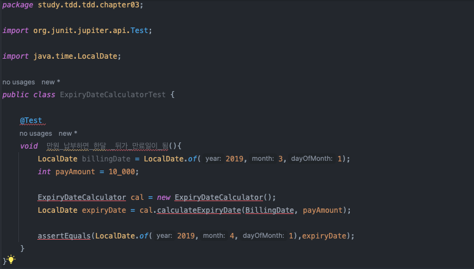
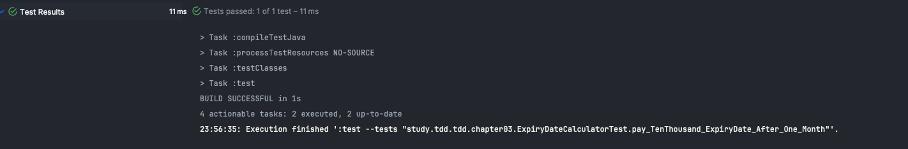
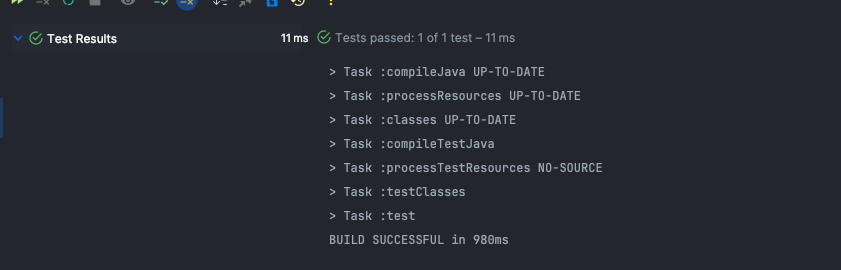
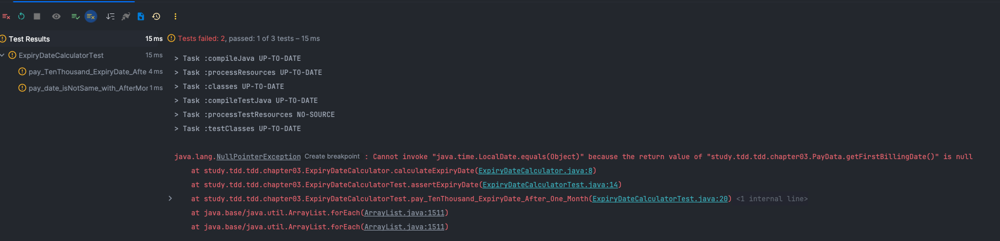
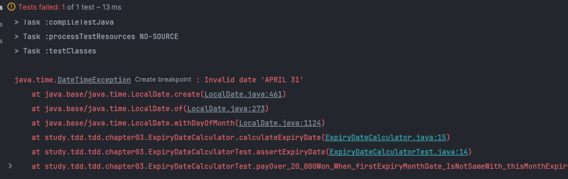
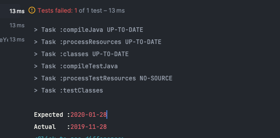

### 초기 테스트는 간단한 조건부터 테스트 
- 다양한 조합을 검사하는 복잡한 상황을 테스트로 추가하면
- 테스트를 통과 시키기 위해 한번에 구현해야할 코드가 많아진다.

> 한번에 많은 코드를 작성하면 많은 버그를 만들어낼 우려가 있다.

### 구현하기 쉬운 테스트 부터 시작하기 
- 빠르게 테스트를 통과 시킬 수 있다. 
- 디버깅할 때 유리하다. ( 머리속에 남아서 어떤 코드였는지 파악하기 쉽다.)

### 예외 상황을 먼저 테스트해야하는 이유 
> 예외 상황은 if-else 구조가 많이 발생하는데
> 이후에 이 코드를 구현하면 코드 구조를 뒤집거나, 예외 상황을 처리하기 위해
> 조건문을 중복으로 추가해야한다.
- 초반에 if-else 구조를 미리 구현되어 있으면, 후에 구조가 덜 바뀐다. 
- 예외상황을 처리하지 않아 발생하는 버그도 줄어든다.

### 완급 조절 
- 한번에 얼마만큼의 코드를 작성할 것인 가가 중요하다.
> 1. 정해진 값 리턴
> 2. 값 비교를 통해 정해진 값 리턴
> 3. 다양한 테스트를 추가하며 구현을 일반화 한다.
- 몇 차례 상수를 사용하여 구현하는 것이 밑거름이 되어 
- 만들어야할 코드가 잘 떠오르지 않을때 점진정으로 구현을 진행할 수 있다.
  

### 지속적인 리팩토링 
- TDD 진행 중 지속적인 리팩토링으로 코드의 가독성이 좋아진다.


# 매달 비용을 지불해야 사용할 수 있는 서비스
- 서비는 다음 규칙에 따라 만료일을 결정한다.
  1. 서스를 사용하려면 매달 1만원 선불 납부, 납ㅜ일 기준 한달 뒤가 서비스 만료일 
  2. 2개월 이상 요금 납부 할 수 있음 
  3. 10만원 납부시 서비스 1년 제공  


## 1. 쉬운  것 부터 테스트 
- 구하기 쉬운 것 부터 테트 
- 예외 상황을 먼저 테스트 
> 만원을 납부하면 한달 뒤 같은 날을 만료일로 계산하는 것이 가장 쉬울 거라고 생각 
```java
package study.tdd.tdd.chapter03;

import org.junit.jupiter.api.Test;

import java.time.LocalDate;

public class ExpiryDateCalculatorTest {

    @Test
    void  만원_납부하면_한달 _뒤가_만료일이_됨(){
        LocalDate billingDate = LocalDate.of(2019,3,1);
        int payAmount = 10_000;

        ExpiryDateCalculator cal = new ExpiryDateCalculator();
        LocalDate expiryDate = cal.calculateExpiryDate(BillingDate, payAmount);

        assertEquals(LocalDate.of(2019,4,1),expiryDate);
    }
}
```


### 구현 로직 
```java
    package study.tdd.tdd.chapter03;

    import java.time.LocalDate;

    public class ExpiryDateCalculator {

        public LocalDate calculateExpiryDate(LocalDate billingDate,int payAmount){
            return LocalDate.of(2019,4,1);
        }
    }
```

## 2. 예시를 추가
- 동일한 예시를 추가하여 일반화에 도움을 준다. ( 상수를 사용 )
### TEST 코드
```java
    @Test
    void  pay_TenThousand_ExpiryDate_After_One_Month(){
        LocalDate billingDate = LocalDate.of(2019,3,1);
        int payAmount = 10_000;

        ExpiryDateCalculator cal = new ExpiryDateCalculator();
        LocalDate expiryDate = cal.calculateExpiryDate(billingDate, payAmount);

        assertEquals(LocalDate.of(2019,4,1),expiryDate);

        // ** Second Case
        LocalDate billingDate2 = LocalDate.of(2019,5,5);
        int payAmount2 = 10_000;
        LocalDate expiryDate2 = cal.calculateExpiryDate(billingDate2, payAmount2);
        assertEquals(LocalDate.of(2019,6,5),expiryDate2);
    }
```

### METHOD 
```java
    public LocalDate calculateExpiryDate(LocalDate billingDate,int payAmount){
        if(billingDate.equals(LocalDate.of(2019,3,1))){
            return LocalDate.of(2019,4,1);
        }
        return LocalDate.of(2019,6,5);
    }
```

- 바로 일반화를 적용한다 ( API 를 사용하여 일반화에 적용)
### METHOD 
```java
    public LocalDate calculateExpiryDate(LocalDate billingDate,int payAmount){
        return billingDate.plusMonths(1);
    }
```



### 3.테스트 코드의 중복 제거 
> 테스트 코드의 중복 제거는 고민해야한다 
> - 각 테스트 메서드는 스스로 무엇을 테스트 하는지 명확히 설명할 수 있어야하기 때문에 
> - 테스트 코드의 중복제거는 신중해야한다.
```java
    // ** 중복 제거를 위한 코드
    private void assertExpiryDate(LocalDate billingDate, int payAmount,LocalDate expectedExpiryDate){
        ExpiryDateCalculator cal = new ExpiryDateCalculator();
        LocalDate realExpiryDate = cal.calculateExpiryDate(billingDate,payAmount);
        assertEquals(expectedExpiryDate,realExpiryDate);
    }

    @Test
    void  pay_TenThousand_ExpiryDate_After_One_Month(){
        assertExpiryDate(
                LocalDate.of(2019,3,1),
                10_000,
                LocalDate.of(2019,4,1));

        assertExpiryDate(
                LocalDate.of(2019,5,5),
                10_000,
                LocalDate.of(2019,6,5));
    }
```

### 4. 예외 상황 처리 - 1
- 예외 상황 예시 
> 납부일이 2019-01-31 이고 납부 액이 1만원이면 만료일은 2019-02-28
> 납부일이 2019-05-31 이고 압부 액이 1만원이면 만료일은 2019-06-30
> 납부일이 2020-01-31 이고 압부 액이 1만원이면 만료일은 2019-20-29
```java
    @Test
    void pay_date_isNotSame_with_AfterMonth_ExpiryDate(){
        assertExpiryDate(
                LocalDate.of(2019,1,31),
                10_000,
                LocalDate.of(2019,2,28));
        assertExpiryDate(
                LocalDate.of(2019,5,31),
                10_000,
                LocalDate.of(2019,6,30));
    }
```
 
다행이도 해당 예외에 대해서 API 가 잘 처리를 해주는 것 같다.

### 5. 에외 상황 처리 - 2
- 예외 상황 
  > 2만원 지불 시 만료일이 두달 뒤가 된다
  > 3만원 지불 시 마뇨일이 세달 뒤가 된다.
  > 납부일이 2019-01-31 이고 만료되는 2019-02-28에 1만원 납부 시 다음 납부 일은 2019-03-31 이다.
  > 납부일이 2019-01-30 이고 만료되는 2019-02-28에 1만원 납부 시 다음 납부 일은 2019-03-30 이다.
  > 납부일이 2019-05-31 이고 만료되는 2019-06-30에 1만원 납부 시 다음 납부 일은 2019-07-31 이다.
- 해당 테스트를 진행하려면 첫 납부일의 데이터가 필요하다.

### 6. 리팩토링 
- 고민해야할 사항
> 1. method 에 첫 납부일 파라미터 추가 
> 2. 첫 납부일 데이터를 담은 객체를 method 에 전달 
> -> 파라미터 개수는 적을 수록 가독성과 유지보수에 좋음, 3개 이상이면 객체로 바꾸는 것을 고려야한다.
> => PayData 라는 Object 추가 생성 
```java
package study.tdd.tdd.chapter03;

import java.time.LocalDate;

public class PayData {
    private LocalDate billingDate;
    private int payAmount;

    private PayData(){}

    public PayData(LocalDate billingDate, int payAmount){
        this.billingDate = billingDate  ;
        this.payAmount   = payAmount    ;
    }

    public LocalDate getBillingDate(){
        return this.billingDate;
    }

    public int getPayAmount(){
        return this.payAmount;
    }

    public static Builder builder(){
        return  new Builder();
    }

    public static class Builder{
        private PayData data = new PayData();

        public Builder billingDate(LocalDate billingDate){
            data.billingDate = billingDate;
            return this;
        }

        public Builder payAmount(int payAmount){
            data.payAmount = payAmount;
            return this;
        }
        
        public PayData build(){
            return data;
        }
    }
}
```

### TEST
```java
package study.tdd.tdd.chapter03;

import org.junit.jupiter.api.Test;

import java.time.LocalDate;

import static org.junit.jupiter.api.Assertions.assertEquals;

public class ExpiryDateCalculatorTest {

    // ** 중복 제거를 위한 코드
    private void assertExpiryDate(PayData payData,LocalDate expectedExpiryDate){
        ExpiryDateCalculator cal = new ExpiryDateCalculator();
        LocalDate realExpiryDate = cal.calculateExpiryDate(payData);
        assertEquals(expectedExpiryDate,realExpiryDate);
    }

    @Test
    void  pay_TenThousand_ExpiryDate_After_One_Month(){
        assertExpiryDate(
                PayData.builder()
                        .billingDate(LocalDate.of(2019,3,1))
                        .payAmount(10_000)
                        .build(),
                LocalDate.of(2019,4,1));

        assertExpiryDate(
                PayData.builder()
                        .billingDate(LocalDate.of(2019,5,5))
                        .payAmount(10_000)
                        .build(),
                LocalDate.of(2019,6,5));
    }

    @Test
    void pay_date_isNotSame_with_AfterMonth_ExpiryDate(){
        assertExpiryDate(
                PayData.builder()
                        .billingDate(LocalDate.of(2019,1,31))
                        .payAmount(10_000)
                        .build(),
                LocalDate.of(2019,2,28));

        assertExpiryDate(
                PayData.builder()
                        .billingDate(LocalDate.of(2019,5,31))
                        .payAmount(10_000)
                        .build(),
                LocalDate.of(2019,6,30));
    }
}
```

### Main Method
```java
package study.tdd.tdd.chapter03;

import java.time.LocalDate;

public class ExpiryDateCalculator {

    public LocalDate calculateExpiryDate(LocalDate billingDate,int payAmount){
        // ** 구현 코드를 일반화
        return billingDate.plusMonths(1);
    }

    public LocalDate calculateExpiryDate(PayData payData){
        return payData.getBillingDate().plusMonths(1);
    }
}
```

## 7. 예외 상황 테스트 진행 
- 첫 납부일 기준으로 만료일 을 계산해야한다. 
- Builder Pattern 으로 작성한 Object 에 필드 추가하여 진행 
```java
package study.tdd.tdd.chapter03;

import java.time.LocalDate;

public class PayData {

    private LocalDate firstBillingDate;
    private LocalDate billingDate;

    private int payAmount;

    private PayData(){}

    public PayData(LocalDate firstBillingDate, LocalDate billingDate, int payAmount){
        this.firstBillingDate    = firstBillingDate   ;
        this.billingDate        = billingDate       ;
        this.payAmount          = payAmount         ;
    }

    public LocalDate getFirstBillingDate(){
        return this.firstBillingDate;
    }
    public LocalDate getBillingDate(){
        return this.billingDate;
    }

    public int getPayAmount(){
        return this.payAmount;
    }

    public static Builder builder(){
        return  new Builder();
    }

    public static class Builder{
        private PayData data = new PayData();

        public Builder firstBillingDate(LocalDate firstBillingDate){
            data.firstBillingDate = firstBillingDate;
            return this;
        }

        public Builder billingDate(LocalDate billingDate){
            data.billingDate = billingDate;
            return this;
        }

        public Builder payAmount(int payAmount){
            data.payAmount = payAmount;
            return this;
        }
        
        public PayData build(){
            return data;
        }
    }
}
```

### 테스트 통과를 위한 상수를 사용하여 main method 수정
```java
    public LocalDate calculateExpiryDate(PayData payData){
        if(payData.getFirstBillingDate().equals(LocalDate.of(2019,1,31))){
            return LocalDate.of(2019,3,31);
        }
        return payData.getBillingDate().plusMonths(1);
    }
```

- 다른 method 에서 NPE 발생 

> 이를 해결하기 위해 NULL 검사 코드 추가 , 역시 아직 일반화가 아니라 상수로 해결 
```java
    package study.tdd.tdd.chapter03;

    import java.time.LocalDate;

    public class ExpiryDateCalculator {

        public LocalDate calculateExpiryDate(PayData payData){
            if(payData.getFirstBillingDate() != null){
                if(payData.getFirstBillingDate().equals(LocalDate.of(2019,1,31))){
                    return LocalDate.of(2019,3,31);
                }
            }
            return payData.getBillingDate().plusMonths(1);
        }
    }

```
- 일반화 하여 수정 
```java
package study.tdd.tdd.chapter03;

import java.time.LocalDate;

public class ExpiryDateCalculator {

    public LocalDate calculateExpiryDate(PayData payData){
        int addMonths = 1;

        if(payData.getFirstBillingDate() != null){
            LocalDate candidateExp = payData.getBillingDate().plusMonths(addMonths);
            
            // ** 현재 달의 마지막 날과 다음 달의 마지막 달을 비교하여 
            // ** 두 날이 다르다면 이전 달의 마지막 날을 다음달의 마지막으로 설정
            if(payData.getFirstBillingDate().getDayOfMonth() != candidateExp.getDayOfMonth()){
                return candidateExp.withDayOfMonth(
                        payData.getFirstBillingDate().getDayOfMonth()
                );
            }
            
        }
        return payData.getBillingDate().plusMonths(addMonths);
    }
}
```
## 8. tnldns xptmxm 
1. 2만원 지불 시 만료일이 두달 뒤
2. 3만원 지불 시 만료일이 석달 뒤 
> TEST Method 를 통해 돈을 지불하고 그 지불한 금액에 비례하여
> 납부 개월 수를 증가 시킴 

```java
package study.tdd.tdd.chapter03;

import java.time.LocalDate;

public class ExpiryDateCalculator {

    public LocalDate calculateExpiryDate(PayData payData){
        int addedMonths = payData.getPayAmount()/ 10_000;
        if(payData.getFirstBillingDate() != null){
            LocalDate candidateExp = payData.getBillingDate().plusMonths(addedMonths);

            // ** 현재 달의 마지막 날과 다음 달의 마지막 달을 비교하여
            // ** 두 날이 다르다면 이전 달의 마지막 날을 다음달의 마지막으로 설정
            if(payData.getFirstBillingDate().getDayOfMonth() != candidateExp.getDayOfMonth()){
                return candidateExp.withDayOfMonth(
                        payData.getFirstBillingDate().getDayOfMonth()
                );
            }

        }
        return payData.getBillingDate().plusMonths(addedMonths);
    }
}

```

### 납부 테스트 만들기 
```java
    @Test
    void payOver_20_000Won_CalculateExpiryDate_From_Money(){
        assertExpiryDate(
                PayData.builder()
                        .billingDate(LocalDate.of(2019,3,1))
                        .payAmount(20_000)
                        .build(),
                LocalDate.of(2019,5,1));

        assertExpiryDate(
                PayData.builder()
                        .billingDate(LocalDate.of(2019,3,1))
                        .payAmount(30_000)
                        .build(),
                LocalDate.of(2019,6,1));
    }
```

## 9 . 에외 상황 테스트 추가 
> 첫 납부일과 납부일의 일자가 다를때 2만원 이상 납부한 경우 
```java
        @Test
        void payOver_20_000Won_When_firstExpiryMonthDate_IsNotSameWith_thisMonthExpiryDate(){
            assertExpiryDate(
                    PayData.builder()
                            .firstBillingDate(LocalDate.of(2019,1,31))
                            .billingDate(LocalDate.of(2019,2,28))
                            .payAmount(20_000)
                            .build(), LocalDate.of(2019,4,30));
        }
    }
```

        

- 4월 31을 만든 오류이다.
> Method 를 수정 = 후보 만료일이 포함된 달의 마지막날 <>

```java
package study.tdd.tdd.chapter03;

import java.time.LocalDate;
import java.time.YearMonth;

public class ExpiryDateCalculator {

    public LocalDate calculateExpiryDate(PayData payData){
        int addedMonths = payData.
        // int addedMonths = payData.getPayAmount()/ 10_000;
        // if(payData.getFirstBillingDate() != null){
        //     LocalDate candidateExp = payData.getBillingDate().plusMonths(addedMonths);

        //     if(payData.getFirstBillingDate().getDayOfMonth() != candidateExp.getDayOfMonth()){
        //         // ** 마지막 달의 마지막날                           
        //         if(YearMonth.from(candidateExp).lengthOfMonth() < payData.getFirstBillingDate().getDayOfMonth()){
        //             return candidateExp.withDayOfMonth(YearMonth.from(candidateExp).lengthOfMonth());
        //         }
        //         return candidateExp.withDayOfMonth(
        //                 payData.getFirstBillingDate().getDayOfMonth()
        //         );
        //     }

        // }
        return payData.getBillingDate().plusMonths(addedMonths);
    }
}
```


## 10 코드 정리
```java
package study.tdd.tdd.chapter03;

import java.time.LocalDate;
import java.time.YearMonth;

public class ExpiryDateCalculator {

    public LocalDate calculateExpiryDate(PayData payData){
        // ** 금액을 나누어서 구독한 개월수를 구함
        int addedMonths = payData.getPayAmount() / 10_000;

        // ** 처음 구독한 날짜가 존재하는 경우 -> 만료일을 추가적으로 계산
        if(payData.getFirstBillingDate() != null ) {
            return expiryDateUsingFirstBillingDate(payData,addedMonths);
        }
        // ** 처음 구독한 날짜가 존재하지 않는 경우
        else{
            return payData.getBillingDate().plusMonths(addedMonths);
        }
    }

    public LocalDate expiryDateUsingFirstBillingDate(PayData payData,int addedMonths){
        
        LocalDate candidateExp = payData.getBillingDate().plusMonths(addedMonths);

        // ** 처음 구독한 달의 마지막 날
        final int dayOffFistBilling = payData.getFirstBillingDate().getDayOfMonth();

        // ** 처음 구독한 달과 만료 달의 마지막 날이 다를 경우 
        if(dayOffFistBilling != candidateExp.getDayOfMonth()){
            // ** 구독 만료하는 달의 마지막 날 수 
            final int dayLenOfCandiMon = YearMonth.from(candidateExp).lengthOfMonth();
            
            // ** 처음 구독한 날과 만료하는 달의 날 중 적은 달을 반환 
            if(dayLenOfCandiMon < dayOffFistBilling ){
                return candidateExp.withDayOfMonth(dayLenOfCandiMon);
            }
            return candidateExp.withDayOfMonth(dayOffFistBilling);
        }
        else{
            return candidateExp;
        }
    }
}
```

## 10 개월 요금 납부 시 1년 제공 
- 테스트 코드 추가 
```java
    @Test
    void pay100_000Won_Subscribe_OneYear(){
        assertExpiryDate(
                PayData.builder()
                        .billingDate(LocalDate.of(2019,1,28))
                        .payAmount(100_000)
                        .build(),
                LocalDate.of(2020,1,28));
    }
```

- 날짜가 안맞는 것을 확인할 수 있다.

### 해결하기 위한 코드 
```java
package study.tdd.tdd.chapter03;

import java.time.LocalDate;
import java.time.YearMonth;

public class ExpiryDateCalculator {

    public LocalDate calculateExpiryDate(PayData payData){
        // ** 금액을 나누어서 구독한 개월수를 구함
        int addedMonths = payData.getPayAmount() == 100_000 ? 12 : payData.getPayAmount() / 10_000;

        // ** 처음 구독한 날짜가 존재하는 경우 -> 만료일을 추가적으로 계산
        if(payData.getFirstBillingDate() != null ) {
            return expiryDateUsingFirstBillingDate(payData,addedMonths);
        }
        // ** 처음 구독한 날짜가 존재하지 않는 경우
        else{
            return payData.getBillingDate().plusMonths(addedMonths);
        }
    }

    public LocalDate expiryDateUsingFirstBillingDate(PayData payData,int addedMonths){

        LocalDate candidateExp = payData.getBillingDate().plusMonths(addedMonths);

        // ** 처음 구독한 달의 마지막 날
        final int dayOffFistBilling = payData.getFirstBillingDate().getDayOfMonth();

        // ** 처음 구독한 달과 만료 달의 마지막 날이 다를 경우
        if(dayOffFistBilling != candidateExp.getDayOfMonth()){
            // ** 구독 만료하는 달의 마지막 날 수
            final int dayLenOfCandiMon = YearMonth.from(candidateExp).lengthOfMonth();

            // ** 처음 구독한 날과 만료하는 달의 날 중 적은 달을 반환
            if(dayLenOfCandiMon < dayOffFistBilling ){
                return candidateExp.withDayOfMonth(dayLenOfCandiMon);
            }
            return candidateExp.withDayOfMonth(dayOffFistBilling);
        }
        else{
            return candidateExp;
        }
    }
}

```

## 테스트 할 목록 정리하기 
- 미리 목록을 만들어 두는 것도 좋은 방법이다.
  1. 1만원 납부하면 한달 뒤가 만료일 
  2. 달의 마지막 날에 납부하면 다음달 마지막 날이 만료일 
  3. 2만원 납부하면 2개월 뒤가 만료일 
  4. 3만원 납부하면 3개월 뒤가 만료일
  5. 10만원을 납부하면 1년뒤가 만료일 

> 여기서 어떤 테스트가 구현이 쉬울지 생각하기
> 여기서 어떤 테스트가 예외적인지 생각해보기

- 새로운 테스트 사례를 발견
> 새로운 테스트 사례를 추가하여 진행하기 
> ( 처음 부터 모든 사례를 정리하려면 시간도 오래 걸릴 뿐더러 쉽지도 않다.)

- 테스트 목록을 적었다고 테스트를 한번에 다 작성하면 안된다.
> 한번에 작성한 테스트코드가 많으면 구현 초기에 
> 리팩토링이 자유롭지 못하다.
>
> 모든 테스트를 통과시키기 전까지 
> 계속해서 깨지는 테스트가 존재하므로 개발 리듬을
> 유지하는 데 도움이 안된다. 
>
> 하나의 테스트 코드를 만들고
> 통과 시키고
> 리팩토링 하고
> 다음 테스트 
>
> 해당 구조를 반복하는 것이 
> 짧은 리듬을 반복하고 개발주기가 짧아져서 
> 집중력도 높아진다. 

- 변경 범위가 매우 큰 리팩토링을 발견하는 경우 
> 시간이 오래 거리므로 TDD 흐름을 깨기 쉽다.
> 이때는 테스트를 하는데 집중한다.
>
> 대신 다음 할일 목록에 추가해서 진행한다.
>
> ( 큰 리팩토링을 발견했을 때 반드시 커밋해놓기 )


## 시작하기 힘들때 
- 검증하는 코드부터 작성 
> 예를 들어 만료일 계산 기능의 경우
> 만료일을 검증하는 코드부터 작성
```java
    @Test
    void pay10_000_then_expiryDate_OneMonthLater(){
        // 처음 작성하는 코드 
        assertEquals(기대하는 만료일, 실제 만료일 )
    }
```


## 구현이 막히면 
- 과감하게 코드를 지우고 미련없이 다시 시작한다.
  > 어떤 순서로 작성했는지 확인해보고 순서를 바꿔서 다시 진행 